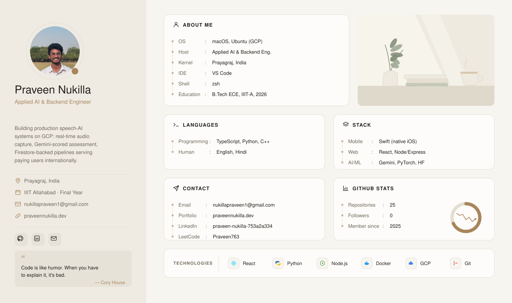

### `SOURCE`

Applied AI & Backend Engineer Intern at **Top Speech Health**, final-year student at **IIIT Allahabad**. I build production speech-AI systems on GCP — real-time audio capture, Gemini-scored assessment, and Firestore-backed pipelines serving paying users internationally.

Right now: hardening a clinical speech-assessment pipeline (Gemini + Praat + FFT) into a paid production tool, and shipping a native iOS therapy app with a live subscriber base.

### `PROCESS`

Traced the way I'd trace a signal — capture, model, serve, ship.

| stage | tools |
|---|---|
| `input`  | `Python` `C++` `JavaScript` `TypeScript` `Swift` `SQL` |
| `model`  | `Gemini API` `PyTorch` `Hugging Face` `Wav2Vec2` `Audio DSP — FFT · Praat · VAD` |
| `serve`  | `Node.js/Express` `React` `Firebase/Firestore` `REST APIs` |
| `deploy` | `GCP — Cloud Functions · Cloud Run · Storage · Logging` `Docker` `GitHub Actions` `MySQL` |

### `OUTPUT`

**400+** DSA problems solved · **2** live products with paying users · **5+** speech-ML models trained and evaluated

— signal end —

